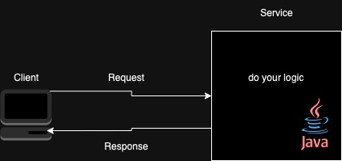
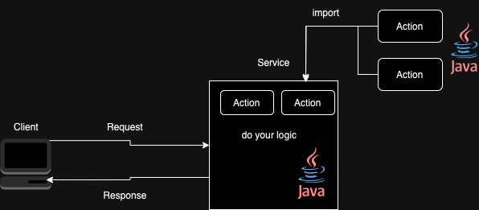

# mingle
`mingle`是一個與`spring boot`框架搭配而成的應用架構，幫助您快速建置專案，專注在業務邏輯開發。

## 主要目標
- 節省開發時間
- 專注業務邏輯
- 統一的開發、維護流程

## 為什麼需要
雖然`spring boot`框架非常強大，但還是需要基礎架構才能完全發揮，`mingle`架構幫助您省去設計、開發時間成本，達到開箱即用。

## 必要條件
- java 17 +
- [spring boot 3](https://spring.io/projects/spring-boot#overview)
- [jackson](https://github.com/FasterXML/jackson)

## 概念
`mingle`中重要的角色，以下介紹：
### service
別名svc，一個API接口，同時也負責處理商業邏輯，提供接收和回應客戶端訊息。

### action
模組或組件。商業邏輯都可以實作成為`action`，提供`service`邏輯的一部份。

可以將`action` 想成多塊獨立拼圖，`service` 則是拼圖組合出來的成品。

## 模組
可以針對需求選擇需要哪些模組，以下簡單介紹：
### mingle-core
基於`spring web`功能的核心模組，負責接收及回應客戶端訊息。
### mingle-svc-action
提供組成`service`邏輯相關模組功能。
### mingle-svc-action-rest
`action`的實現之一，提供`RESTful`客戶端的功能。
### mingle-svc-session
基於`spring security`，提供`service`的驗證、授權功能。
### mingle-svc-data
基於`spring data jpa`，提供`DAO`架構。
### mingle-svc-redis
基於`spring data redis`，提供`redis`架構。
